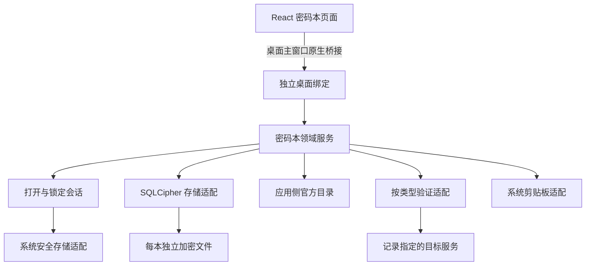

# GoNavi 本地密码本技术方案 v1.0

- 整理日期：2026-10-05。
- 阶段：设计定稿，尚未实现、构建或执行集成测试。
- 配套需求：`requirements.md`。产品行为以最新会话及配套需求为准。
- 文档范围：首版架构、数据模型、访问与安全边界、异常处理、验证标准和后续实施顺序。
- 本文件仅供当前 clone 本地讨论，位于忽略目录，不进入产品提交或上游 PR。
- “采用”表示方案决策；“默认”表示本方案选择的可调整参数；“待实测”表示工程验证门槛，不冒充已经验证可用。

## 1. 目标、范围与核心决策

提供多个相互独立的本地密码本，让用户集中记录并按平台快速找到 Key、Token、账号密码、数据库及服务器信息。保存不要求 GoNavi 实际使用或连接对应服务。

核心目标是保护本地持久化及减少误泄漏。任何设备和系统账户已被全面控制时仍绝对安全，不属于产品承诺；也没有证明本方案在所有威胁下优于微信等产品。SQLCipher 选型依据官方能力，不以尚未核实的微信实现作为证明。

| 编号 | 采用的决策 | 原因或边界 |
| --- | --- | --- |
| D01 | 每个密码本独立 SQLCipher 文件、目录和密钥 | 隔离生命周期、故障和未来迁移 |
| D02 | 所有记录字段、历史、备注、索引和用户结构在整库加密范围内 | 不仅加密密码字段 |
| D03 | 每本随机 256 位密钥，由系统安全存储保管 | 无额外主密码，密钥与数据文件分离 |
| D04 | 系统保管或加密能力不可用时失败关闭 | 不明文降级，不覆盖原密钥 |
| D05 | 官方定义放 GoNavi 原生应用配置数据库一侧 | 不复制进每本，不随预设更新批量改写用户记录 |
| D06 | 自定义类型和字段修订随对应密码本保存 | 用户结构属于用户数据 |
| D07 | 固定物理业务表，记录内容采用结构化快照 | 产品类型不要求一类型一 SQL 表 |
| D08 | 历史采用不可变完整快照，恢复新增版本 | 保留后续所有版本，不截断历史 |
| D09 | 当前本内后端搜索、分页及按需读取秘密 | 不把全本明文交给前端 |
| D10 | 桌面主窗口原生 Wails 桥接 | 不为搜索新增 localhost HTTP 服务 |
| D11 | 独立受控桌面绑定，不注册 Web/MCP 能力 | UI 隐藏不能替代后端隔离 |
| D12 | 创建保存成功后自动验证一次，之后手动验证 | 网络不阻塞保存、不在重开时巡检 |
| D13 | 剪贴板秘密清理提供开关和时长 | 用户控制，清理不影响真实凭据有效期 |
| D14 | 记录固定保存实际连接目标 | 厂商预设更新不能自动改变密钥接收方 |
| D15 | 首版不实现云端、导入导出、备份迁移和 LAN 同步 | 只预留稳定身份和格式版本 |

首版内置类型：大模型 API Key、云服务凭据、数据库、服务器、平台账号。支持用户自定义类型；内置类型不允许追加字段，保留备注。

首版服务器认证模板采用用户名/密码；SSH 密码认证可验证，其他协议只记录。专用私钥字段、加密私钥认证及 SSH 终端留到后续版本；用户自定义秘密字段仍可用于保存其他文本凭据。

## 2. 总体架构与入口

“后端”是桌面程序的 Go 逻辑。搜索通过原生消息桥调用，不等同于浏览器请求本地 HTTP 服务。已核对当前 Wails v2.15.0 DesktopIPC：Windows 使用 WebView2 原生 postMessage，macOS/Linux 使用 WebKit 消息处理通道。

普通 HTTP 抓包代理不是这条桥接的直接读取入口；进程注入、恶意前端脚本、调试和系统级攻击仍可能读取使用中的明文。增加一层由前端自行解密的通信加密不能替代端点访问控制。

现有 Web RPC 和原生分离窗口 HTTP 桥是另一条路径。首版密码本工作区限定主窗口，不支持分离成独立系统窗口；详情抽屉、模态表单正常支持。独立窗口支持需要另行验证受控通信，不能默认接入 HTTP 桥。

密码本服务只在桌面主窗口运行模式创建并注册。Web Server、MCP、headless 模式和原生子窗口不取得其实例或密钥能力。不得通过 App 的公开 getter 间接返回密码本服务。

当前 `internal/webserver/server_invoke.go` 按 MethodByName 调用 App/AI 方法，且原生窗口路径存在 allowDesktopMethods 模式；不能只依赖现有 desktop-only 方法名单保护新能力。优先采用不在上述反射目标中的独立绑定对象，并验证全部入口。

绑定层遵循已有 QueryResult、i18n 和错误收敛规则；领域层不依赖 React/Wails。会话检查和数据范围校验在后端执行，不相信前端传入的“桌面身份”或“已解锁”布尔值。

## 3. 持久化职责划分

| 保存位置 | 内容 | 不应包含 |
| --- | --- | --- |
| GoNavi 原生应用配置数据库 | 官方类型及修订、厂商预设、管理入口、复制/验证规则、安全偏好、最少密码本定位信息 | 用户记录、明文秘密、解密密钥、搜索摘要 |
| 每本 SQLCipher 数据库 | 本名称、当前记录、版本快照、自定义结构、验证结果、用户认可的服务器身份、检索索引 | 完整官方模板或平台目录副本 |
| 系统安全存储 | 每本密钥；必要的受保护显示名称缓存 | 大量记录和历史 |
| 会话内存 | 暂时使用的密钥、表单值、查询结果及验证认证数据 | 持久化明文副本 |

官方默认目录由版本控制中的代码/随包资源提供权威来源，在应用侧配置数据库维护发布修订。应用配置层可保存用户安全偏好，但官方定义不能让任意用户配置覆盖为可执行脚本。

现有应用全局持久化具体接线在实施时核实；不将当前普通 SQLite 驱动或某个业务库误称为已经具备所需配置表。此核实不改变“系统定义在应用侧、用户记录在密码本”的约定。

应用侧只登记随机 book_id、受控位置、无业务含义的密钥引用与必要操作状态。磁盘路径不含平台、记录名称或账号；从内部标识生成，不接受前端任意路径。

密码本显示名称可能敏感：权威值保存在 book_meta；导航所需缓存使用独立系统保护条目，不把解密密钥交给前端。该条目不可访问时显示通用“未解锁密码本”，不降级为明文缓存。修改名称以加密文件事务为准，缓存失败可在下次打开后修复，不改动密钥。

## 4. 文件格式与 SQLCipher 安全配置

### 4.1 容器与连接

每本使用独立私有目录，包含主库和必要的 WAL/journal 等辅助文件。使用随机标识命名；POSIX 权限和 Windows 当前用户 ACL 作为额外保护，不替代加密。

采用经评估的 Go 绑定，连接锁定版本的官方 SQLCipher 原生库；现有 modernc 普通 SQLite 路径继续独立。SQLCipher 不是为普通 SQLite 添加一条 PRAGMA 就能启用的插件。

现阶段不指定最终 Go 包。社区版是首选候选，最终原生库、密码库、Go 绑定版本及许可证清单在集成验证后锁定。mutecomm/go-sqlcipher 只是调研候选，其维护文档提到旧内核版本，不据此认定其满足更新要求。

首版每本使用独立、受控连接生命周期，建议 MaxOpenConns=1、MaxIdleConns=1，并串行化存储操作。新建连接、重连均必须执行同一初始化过程；不允许仅对连接池里某一次连接设置密钥。

每个连接在访问用户表之前：确认实际 SQLCipher 能力，按原始密钥契约设密钥和加密格式，设置安全参数，再读取元数据确认身份/版本。不存在预期 cipher_version、无法验证密钥或文件格式不匹配时立即终止。

随机密钥使用 SQLCipher raw-key 契约，避免误当人类口令或错误截断。绑定正确处理格式，密钥不得进入可打印 DSN、命令行参数或 SQL trace，优先使用受控连接初始化/API。

### 4.2 安全参数

- 保留 SQLCipher 页认证，不关闭 HMAC；不随意降低加密安全参数。
- 保持默认加密头策略，不为了识别文件而暴露业务 schema；公开盐及文件大小不属于业务明文。
- 禁止文件临时存储；编译配置与 temp_store=MEMORY 共同验证，不只检查主库。
- 建议启用 cipher_memory_security，并评估性能；该功能不负责清理 Go/JavaScript 的副本。
- WAL + synchronous=FULL 作为首版建议，结合崩溃恢复验证，不在运行中随意复制主库。
- 关闭不需要的动态扩展加载、通用 ATTACH/明文导出入口和任意 SQL 执行。
- 业务查询参数化；即使全文来自本地，也按不可信输入处理。
- 完整性检查结合 SQLCipher 页认证检查与 SQLite 逻辑检查；设置密钥成功本身不代表打开成功。

SQLCipher 加密主库和日志中的数据页；其他临时文件需主动禁止。它不隐藏文件大小、访问时序，也不自动识别整库被替换成旧的合法副本。[官方设计说明](https://www.zetetic.net/sqlcipher/design/)

密钥初始化、页认证、内存清理开关及格式迁移按所选版本的官方 API 验证，不盲目复制网上 PRAGMA 示例。[官方 API](https://www.zetetic.net/sqlcipher/sqlcipher-api/)

## 5. 系统密钥策略与生命周期

### 5.1 平台策略

| 平台 | 首选 | 验证重点 |
| --- | --- | --- |
| macOS | 本地 Keychain，限制受信任应用访问，不主动启用云同步 | 签名身份、升级连续性、授权和锁定行为 |
| Windows | 当前用户 Credential Manager；必要时评估用户范围 DPAPI | 账户边界、持久性、应用升级、权限拒绝，不采用机器范围保护 |
| Linux | 合格的持久化 Secret Service/KWallet | 解锁、重启后持久性、服务缺失，不默认复用临时 KeyCtl fallback |

现有 secretstore 可复用接口和部分适配经验，但密码本使用独立命名空间及失败策略；现有 dailysecret 明文 JSON 路径禁止用来保存密码本密钥。

账户保管不等于全平台的应用身份隔离。Touch ID/Windows Hello 等额外用户在场认证是后续增强候选，需要与密钥释放实际绑定，不用普通确认框冒充密码学保护。[Microsoft 用户范围说明](https://learn.microsoft.com/en-us/windows/win32/api/dpapi/nf-dpapi-cryptprotectdata)、[Apple 应用访问控制](https://developer.apple.com/documentation/security/access-control-lists)

### 5.2 创建和打开

创建按顺序执行：检查能力 → 生成随机密钥 → 系统保管 → 新建临时加密容器 → 写入/校验 book_meta → 发布文件 → 登记入口 → 返回成功。

系统凭据存储与文件没有共同事务。任何中间失败都采用补偿处理：不能清理其他密码本；新密钥仅在确认没有需要保留的关联数据后删除。中断后重新检查可恢复状态，不把临时容器作为正常密码本显示。

打开已有本：定位既有文件和密钥 → 读取系统保管条目 → 初始化加密连接 → 校验本标识、存储格式和官方定义兼容性 → 创建会话。

已存在的密码本不得使用自动 CREATE 或自动生成密钥进行“修复”。文件丢失、密钥找不到、权限拒绝、密钥错误与文件损坏应尽量分类；无法可靠区分错误密钥和损坏时如实给出联合原因，不编造判断。

### 5.3 三种系统保管失败

| 情况 | 产品行为 |
| --- | --- |
| 新建时无法安全写入密钥 | 不完成创建，说明原因并允许重试 |
| 已有密钥暂时取不到，例如锁定、服务异常或拒绝授权 | 保留文件和引用，恢复访问后可重试 |
| 原密钥确实删除/遗失 | 保留文件并说明恢复限制，绝不生成新密钥覆盖旧引用 |

首版没有用户级备份、导入或跨设备恢复。单独复制文件不是完整备份；系统重装/密钥丢失可能不可恢复，创建流程简短说明一次。

## 6. 会话、锁定与未保存编辑

内部区分 Closed、Opening、Open、Locking、Locked、Error，视图状态不能代替后端状态。打开后建立随机会话标识与会话代次，所有敏感操作要求当前有效会话和对应 book_id。

锁定先阻止新操作并增加会话代次，再取消查询/验证，关闭数据库连接并清理可控缓冲区；前端隐藏详情、清除已加载秘密和列表缓存。迟到响应、重复请求和旧定时器不能重新填回已锁定页面。

采用手动锁定和系统锁屏/休眠时锁定。默认空闲 10 分钟锁定作为可调整设置；用户在密码本内操作才更新活动时间，背景网络任务不延长会话。

未保存编辑采用以下默认交互：

- 手动关闭或锁定前，提供保存、放弃、取消；不静默保存，不直接丢弃一次性 Key。
- 系统锁屏立即遮蔽界面并停止操作，不等待确认。
- 系统锁屏后，尚未提交的编辑草稿只允许在当前会话的短期内存中保留，重新解锁后恢复编辑；清理其他从库加载的秘密。应用退出不持久化该草稿，并提示未保存内容会丢失。
- 草稿不能进前端持久化状态或普通文件；保留草稿意味着不承诺锁定后全部敏感内存已清空。后续若采用加密内存草稿，应单独验证，不能在本阶段声称已实现。

系统锁定及休眠事件的跨平台能力需实测，不能只实现前端遮罩就声称数据库已经锁定。自动锁定减少应用暴露时长，不承诺阻止同账户恶意程序静默重新取钥。

## 7. 官方目录、字段标识与兼容

官方目录含：type_id、definition_revision、稳定 field_id、数据类型、必填/显示/秘密属性、provider_id、服务模式、地址建议、协议/认证方式、管理入口、验证能力和连接字符串格式。

官方发布修订在应用侧保留兼容信息。名称和翻译变动不改标识；字段退役不能让旧快照丢失。未知类型/字段尽可能只读展示原始用户内容，禁止静默删字段再保存。

已保存的实际 URL、协议、端口、认证方式、服务模式及验证模型是用户数据。预设更新只改变新建时建议，不重定向旧记录，不自动重测，也不把记录变成现有 AI/数据库连接配置。

内置表单变化通过目录解释用户内容，通常不改物理 schema。结构性存储变化仍需要迁移，不能承诺永远不修改密码本文件。

自定义类型采用稳定 type_id/field_id 和独立 schema_revision。允许改名、排序、追加字段；已用于记录的字段首版不允许删除或改变数据类型。旧记录不因新增必填字段失去读取能力，下次主动编辑时按当前定义补齐。

## 8. 数据模型与事务

以下是逻辑模型，字段名是设计建议，实际 DDL 在选定驱动后落实。所有表和索引都在每本 SQLCipher 内。

| 表 | 主要字段与职责 |
| --- | --- |
| book_meta | book_id、name、storage_version、crypto_profile、created_at；不含密钥 |
| records | record_id、type_id、type_origin、current_revision_id、名称/平台/账号/地址/用途等检索列、use_status、expiry_mode、expires_on、created_at、updated_at、validation_config_id |
| record_versions | revision_id、record_id、local_sequence、parent_revision_id、operation、restored_from_revision_id、definition_ref、payload_json、saved_at |
| custom_types | type_id、name、current_schema_revision_id |
| custom_type_versions | schema_revision_id、type_id、parent_revision_id、definition_json、saved_at |
| verification_results | check_id、record_id、validation_config_id、scope、result、reason_code、checked_at；不保存完整请求响应 |
| host_trust | 用户认可的 SSH 目标、主机指纹及确认时间；不要新增含地址的明文信任文件 |

payload_json 保存全部可编辑内容，以稳定字段标识寻址；definition_ref 指向应用侧官方修订或本内自定义修订。检索列是当前快照的派生投影，必须同一事务更新。

record_id/revision_id/schema_revision_id/book_id 使用随机 UUID 等稳定标识。local_sequence 仅用于本地 V1/V2 显示，不作为未来跨设备版本身份。

同一本允许同名、同账号、同平台的多条记录；不以这些字段强制唯一。数据库约束确保版本归属、当前版本引用及本地序号一致。跨本参数不能读取其他文件。

编辑携带 expected_revision_id；事务内核实仍为当前版本，否则返回编辑冲突，不默默覆盖。不把网络请求放在事务中。

密钥、密码不能进入未加密 hash 索引。验证配置身份使用相关字段变化时更新的随机标识，避免把秘密的普通哈希作为外部可见比较值。

## 9. 内容保存、复制与历史恢复

新增：校验用户内容 → 单事务插入 V1 与当前索引 → 提交 → 返回成功 → 按支持能力尝试首次验证。重试/重复提交用短期操作标识消除重复创建或重复自动测试，不增加内容版本。

编辑：比较有效内容变化 → 无变化不新增版本 → 变化时事务追加快照、更新 current_revision 与检索投影。相关连接字段变化同时更换 validation_config_id；名称、用途、备注变化不更换。

恢复：读取目标快照及其定义修订 → 校验归属和 expected_revision → 追加新快照并记录恢复来源 → 更新当前引用和索引 → 提交。V4 恢复 V2 生成 V5，V1—V4 保留。

完整恢复包含用户状态、有效期和备注，保留记录身份及原创建时间。历史按当时定义展示；新版本可以沿用旧快照定义引用。恢复不因后来新增的必填项被拒绝，下一次主动编辑再按当前定义补齐。

恢复不带回旧验证结果；连接配置变化使结果过期，不自动测试。重测不新增内容版本，恢复也不会修改真实服务凭据。内容相同的恢复不新增无意义快照。

复制为新记录生成独立身份、V1、创建时间和验证配置身份，不继承历史/验证结果。前端可引用源记录及源版本预填普通字段，未修改的秘密由后端复制，减少向前端批量返回秘密；保存时核实源版本存在且归属当前本。

删除记录时事务删除其当前索引、版本和验证数据，先取消在途操作。首版不设回收站；历史恢复适用于仍存在的记录。逻辑删除不承诺清除了旧磁盘副本或 SSD 上可恢复内容。

## 10. 搜索、DTO 与前端状态

搜索仅在已打开当前本内执行；可跨该本类型，不跨本、不默认搜索秘密及历史。匹配名称、平台、账号、地址、用途、备注等非秘密字段，配合使用状态、有效期、验证筛选。

首版使用参数化查询及适量索引；不为首版引入外部搜索服务。默认每页 50 条，单次上限 200 条作为工程默认值；排序稳定，支持变更后的刷新。更大的数据规模再评估 FTS/游标分页。

| 数据传递 | 返回规则 |
| --- | --- |
| 列表 | 当前页普通展示字段、状态、验证摘要和 has_secret 标识；不返回秘密值或全历史 |
| 详情 | 普通字段及秘密存在标识；秘密默认隐藏 |
| 编辑 | 普通值及秘密保留标识；秘密更新区分 keep、replace、clear |
| 历史列表/差异 | 时间、操作、字段变化摘要；秘密旧值/新值均遮蔽 |
| 查看秘密 | 按记录、版本、field_id 主动读取一个值；后端校验字段与会话 |
| 复制秘密 | 后端读取后写系统剪贴板，返回操作结果 |

不得用空字符串同时表示“保留原秘密”和“清空秘密”。前端更新只允许所选类型可编辑字段；拒绝越权版本、未知操作和任意路径。

前端使用独立密码本模块和短期状态。秘密/列表不进入持久化 Zustand、localStorage、IndexedDB、Service Worker 缓存、URL 参数、控制台、错误上报或 AI 上下文。关闭/锁定时清理查询响应与详情，已显示字段可在关闭详情时重新隐藏。

备注和自定义字段按文本渲染，不执行 HTML/脚本。分页、版本列表和错误消息不通过通用结果表格自动进入导出/AI取数功能。

## 11. 剪贴板、连接字符串与浏览器跳转

应用级安全配置提供：clipboard_clear_enabled 和 clipboard_clear_seconds。采用默认启用、30 秒，用户可关闭或改为正整数秒；设置只包含偏好，无秘密值。

秘密字段及含秘密的连接字符串受清理规则约束；普通地址、端口和用户名不自动清理。清理不使真实 Key/密码失效。

每次复制记录本次操作身份。新一次 GoNavi 复制使旧定时器失效；到期仅在能确认剪贴板仍为本次写入时清理。其他软件随后写入内容不得被覆盖，即使内容相同也优先使用平台变化序号判断。缺乏可靠检测/原子条件写入能力时明确边界，禁止无条件清空。

不承诺从系统剪贴板历史、跨设备同步或已读取内容的软件中撤回数据。平台可用的排除历史/同步能力作为适配增强，需实测；不改变系统全局设置。

连接字符串使用类型/格式专用适配，正确转义特殊字符，选项明确是否包含密码。实际支持的格式由发布能力清单列出，不能声称一种 DSN 通用于所有客户端。

内置平台管理地址来自应用官方目录；平台账号登录地址来自用户内容。只允许明确 http/https 网页地址，由系统默认浏览器打开；不附加 Key、Token、账号密码或自动登录参数。自定义中转站没有管理入口时不猜测地址。

## 12. 验证能力、任务与网络策略

| 类型 | 首版验证 | 结果范围 |
| --- | --- | --- |
| 大模型 API Key | 优先官方基础接口，必要时最小推理 | 当前地址/协议及相应认证或指定模型请求 |
| 云服务凭据 | 不验证 | 保存和管理入口跳转 |
| 数据库 | 已支持驱动的短连接/认证 | 连接与认证，不保证所有业务权限 |
| 服务器 | SSH 密码认证，认可主机身份后关闭 | 当前目标认证，不执行命令 |
| 平台账号、自定义类型 | 不验证 | 保存及适用网页跳转 |

AI 厂商目录共用 GoNavi 现有 API 厂商来源，至少包含已有 DeepSeek、Kimi、MiMo 及自定义兼容服务；CLI、订阅登录、本地模型不因存在于 AI 设置就自动成为 API Key 模板。管理 URL 需补充到共享官方目录。

逐平台发布能力必须记录 provider_id、协议/服务模式、检查方式、模型需求、认证目标和支持状态。现有代码并不证明平台接口实际可用；不使用真实付费凭据执行本阶段验证。

任务状态：未测试、测试中、通过、失败、无法验证；原因细分不等同于新增用户维护状态。用户状态、有效期和验证结果各自独立。

创建成功后只自动尝试一次。没有所需模型/驱动/网络条件时记录无法验证，不阻止保存，不在重开或重启后补跑。失败、超时、取消均不自动重试；后续按钮可测试。

创建/重测分配 check_id，限制同一记录并发，携带 book_id、会话代次、validation_config_id。完成时原子检查当前配置、任务和会话仍匹配；迟到结果不能覆盖新测试或新配置。仅修改名称/备注不让结果失效。

取消、锁定、关闭、删除及退出会取消相关上下文、关闭连接；不能只让 UI 停止转圈而后台继续持钥执行。既定默认总请求超时和各协议连接超时在适配器中定义并测试，网络阶段不无限等待。

不发送用户项目、其他记录、历史或备注作为模型输入。最小推理用固定无业务内容文本与协议允许的最小生成量，检查真实响应结构；不能以静态模型列表或 HTTP 200 判定成功。创建表单和重测操作简短说明可能产生少量调用费用。

认证拒绝等明确结果表示失败；超时、网络不可达、服务故障、限流/额度、权限不足、协议不支持等按实际原因表达无法验证。HTTP 403 不能统一解释为密码错误；200 HTML 页面不能判为通过。

测试只向保存的明确目标及受信任官方规则确定的认证端点发送信息，禁止携带凭据自动跨源重定向。优先 HTTPS 并校验证书，不默认跳过 TLS 验证；HTTP 自定义地址仍可保存，首版默认不自动向其发送秘密。内网数据库/SSH不因非HTTPS就误判不支持，其协议安全能力另行表达。

复用现有代理策略前核实其是否明确生效及会否记录 URL/头部。请求与响应不进入通用 HTTP trace，错误文本进行脱敏；第三方响应长度限制，不能把完整响应作为验证结果保存。

数据库仅用临时独立连接并释放，不写业务数据。已有数据库验证要检查驱动是否绕过上下文、保存配置或打印 DSN。

SSH 主机身份确认不可禁用，首次未知主机按可信确认流程处理，变化时拒绝认证。复用校验算法，用户认可的指纹保存在本内，不新增明文目标信息；现有 SSH 日志及连接入口需适配，不直接照搬打印地址/用户的路径。

## 13. 异常、迁移与删除生命周期

| 异常 | 要求 |
| --- | --- |
| 系统存储拒绝/不可用 | 保留既有文件与密钥引用，说明原因可重试 |
| 密钥丢失 | 不重新生成覆盖；说明恢复限制 |
| 文件损坏/打开失败 | 关闭连接、保留原文件，不自动重建空本 |
| 磁盘不足/写入失败 | 保存事务失败不改变当前版本，提醒输入尚未保存 |
| 编辑冲突 | 不覆盖其他版本，允许用户重新查看后处理 |
| 验证失败 | 记录仍保存成功；只影响验证状态 |
| 当前应用不支持更高格式 | 拒绝写入，不尝试降级修改 |
| 官方目录不兼容 | 尽量只读展示旧内容，不删除未知字段 |
| 删除中断 | 保留明确待清理状态，重试清理，不冒充删除成功 |

区分三种版本：应用官方定义修订、密码本物理 storage_version、SQLCipher crypto_profile。更新默认厂商配置通常不触发物理迁移；不能混用这三种版本。

真正迁移前停止其他写入，生成一致的加密回退副本并验证。普通表结构迁移走事务；改变加密格式或整库导出时创建已设密钥的目标文件，验证后安全替换，禁止经过明文中间文件。回退副本仅用于内部迁移保护，仍依赖原密钥，不等于首版用户备份功能。

不能在 WAL 活跃时只复制主库。采用经过 SQLCipher 验证的一致性备份路径，目标也必须明确加密，不根据普通 SQLite 的 backup API 名称假定安全。

删除密码本：确认范围 → 标记删除中 → 阻止新操作并关闭会话 → 清理主库与辅助文件 → 移除对应系统密钥/名称缓存 → 完成入口清理。文件未能清理时不要提前删除仍可能需要的唯一密钥；部分完成保留状态并可重试。

删除不承诺取证意义的物理擦除。内部残留和未完成操作清理仅作用于本功能拥有的随机目录，禁止通用路径递归清理。

## 14. 模块拆分和复用范围

后端建议：`internal/passwordbook` 领域服务/模型/会话；存储与迁移子模块；系统密钥适配；类型目录；验证适配；独立桌面绑定。平台差异使用 *_darwin.go、*_windows.go、*_linux.go / stub 文件，不堆在同一函数。

前端建议：`components/passwordbook/` 拆列表、表单、详情、历史、安全设置；独立短期状态及 hooks；协议格式纯函数或调用后端适配。根 App、Sidebar、store 仅接线，遵守超标文件禁止净增加行数的要求。

| 现有能力 | 复用方向 | 必须调整/核实 |
| --- | --- | --- |
| AI 厂商预设 | 抽公共元数据，与 AI 设置共用 | 不导入整个设置组件，补管理入口，过滤 CLI/登录模式 |
| AI 基础检查 | 协议/认证构造及能力经验 | 硬编码端点、响应结构、Key URL、上下文、日志、代理和费用范围 |
| 数据库连接测试 | 驱动与临时连接生命周期 | 目标配置不持久化到已有连接；日志和上下文策略 |
| SSH | 认证与主机身份校验算法 | 不执行命令，不复用含业务地址的明文日志/文件 |
| secretstore | 接口与合格平台后端 | 专属命名空间、持久性、授权、禁止明文或临时兜底 |
| AI 加密 ledger | 密钥生命周期和错误分类经验 | 不把密码本放进 AI ledger，不复制其未加密元数据边界 |
| Wails 绑定 | 原生桌面主窗口消息桥 | 服务不被 Web/MCP/子窗口反射或通用导出取得 |

用户可见文案走 shared/i18n 全语言资源。Wails 生成文件不手改，新增生产源文件/函数遵守仓库体积限制；不引入 Electron、新 UI 库或状态库。

## 15. 安全设置与默认值

| 项目 | 首版方案 |
| --- | --- |
| 秘密显示 | 默认隐藏，主动显示；关闭详情恢复隐藏 |
| 剪贴板清理 | 可关闭；默认启用、30 秒，可设置正整数秒 |
| 手动锁定 | 提供 |
| 系统锁屏/休眠 | 自动锁定/遮蔽，具体平台事件能力需实测 |
| 空闲锁定 | 默认 10 分钟，可调整；属于设计默认 |
| 首次自动测试 | 创建成功且可验证时尝试一次，后续只手动 |
| 历史保留 | 不自动截断 |
| 有效期提醒 | 默认七天内即将到期，不后台通知 |
| 列表分页 | 默认 50 条，上限 200 条，属于工程默认 |

安全偏好在应用侧保存，不进每本。配置更新以明确规则应用到尚未完成的剪贴板任务；关闭自动清理取消本功能待执行任务，新复制采用最新时长，不改变凭据有效期。

## 16. 验收和实施门槛

下面是后续需要执行的验证，本次只检查文档和仓库事实，没有把测试计划写成已通过。

| 组别 | 关键验收 |
| --- | --- |
| 真正加密 | 实际 cipher_version/密码库确认；正确密钥可读，错误/缺失密钥不可读；普通 SQLite 无法读记录 |
| 加密覆盖 | 专用测试标记覆盖当前、历史、备注、索引、自定义结构；检查主库/WAL/journal/临时文件/日志/前端持久化；查不到字符串仅是辅助证据 |
| 密钥 | 拒绝授权、服务缺失、锁定、重启持久性、升级/签名变化；不明文兜底、不替换旧密钥 |
| 保存可靠性 | 崩溃恢复、磁盘写入失败、重复操作、编辑冲突、版本与当前索引原子一致 |
| 历史兼容 | V4 恢复 V2 得 V5；历史秘密按需读取；新必填字段不破坏旧版本恢复；旧定义保留 |
| 会话隔离 | 锁定后拒绝读取/复制/测试；跨本参数拒绝；迟到结果不恢复页面或覆盖当前验证 |
| 外部入口 | Web/MCP/headless/子窗口不取得服务；普通配置导出、AI 上下文不能取得记录或密钥 |
| 网络 | 错误目标/重定向不泄漏凭据；HTTP200异常体不通过；取消/超时释放资源；SSH指纹不绕过 |
| 剪贴板 | 开关、时长、连续复制、其他软件后续写入、锁定与退出；不误清理新内容，不夸大撤回能力 |
| 更新/删除 | 一致加密回退、迁移失败、未知新版拒写；删除中断可识别，唯一密钥不提前删除 |
| 平台构建 | macOS/Windows/Linux 的 amd64/arm64 及 Linux WebKit 变体；无需密码本的 CGO=0 辅助产物依赖隔离 |
| 用户路径 | 多本、按平台搜索、内网信息保存、类型专属复制、历史恢复、设置和浏览器跳转 |

实施顺序：

1. 原生 SQLCipher/Go 绑定及三平台系统密钥能力验证，锁定合格依赖、版本、构建参数和许可证。
2. 实现隔离存储、创建/打开/锁定生命周期、异常分类及事务/快照基础，先通过安全和可靠性测试。
3. 接入应用官方目录、内置与自定义类型、主窗口受控绑定和秘密按需读取。
4. 完成列表/表单/历史/搜索/复制/设置及 i18n，验证真实用户路径。
5. 按能力清单接入验证器，覆盖取消、过期结果、错误分类和网络目标边界。
6. 完成跨平台打包与人工验收，记录实际通过及未支持的能力。

第 1 步不合格时，调整绑定/平台适配方案，不降低加密和密钥安全标准。系统能力不满足的平台明确标记密码本不可用，不用明文功能充数。

## 17. 后续版本预留及未完成事项

预留随机身份、父版本关系、自定义结构修订和物理格式版本。后续备份用独立加密逻辑包，迁移在目标设备重新保管本地密钥；特殊文件扩展名不承担加密保护。

LAN 同步需设备配对、身份认证、加密传输、去重和冲突处理，不能假定同局域网天然可信，也不共享打开中的 SQLite 文件。首版不提前开发同步协议/云账号。

后续可扩展：独立窗口、SSH 私钥、云凭据验证、AI/数据库连接主动联动、用户在场认证。没有自动读取项目凭据或默认向 AI 开放的计划。

尚未完成、由后续工程验证决定的事项：最终 Go/SQLCipher/密码库依赖，Linux 后端资格，稳定签名和升级访问策略，各平台锁屏/剪贴板事件能力，逐厂商/数据库/连接字符串发布支持清单。架构不再等待用户选择具体库，但能力不能在验证前标为可用。

## 18. 资料与本地核实记录

- [SQLCipher 设计与临时文件边界](https://www.zetetic.net/sqlcipher/design/)
- [SQLCipher API 与密钥/内存/迁移](https://www.zetetic.net/sqlcipher/sqlcipher-api/)
- [SQLCipher 社区版](https://www.zetetic.net/sqlcipher/community/)
- [SQLite PRAGMA：未知命令与临时存储](https://www.sqlite.org/pragma.html)
- [SQLite 一致性备份](https://www.sqlite.org/backup.html)
- [Microsoft DPAPI 用户保护范围](https://learn.microsoft.com/en-us/windows/win32/api/dpapi/nf-dpapi-cryptprotectdata)
- [Apple Keychain 应用访问控制](https://developer.apple.com/documentation/security/access-control-lists)
- [Apple 代码签名与 Keychain 权限](https://developer.apple.com/library/archive/documentation/Security/Conceptual/CodeSigningGuide/AboutCS/AboutCS.html)
- [Secret Service 规范](https://specifications.freedesktop.org/secret-service/latest/)
- [Wails Go/前端绑定](https://v2.wails.io/docs/howdoesitwork/)
- [mutecomm/go-sqlcipher 维护说明](https://github.com/mutecomm/go-sqlcipher/blob/master/MAINTENANCE)

本地核实入口：go.mod；internal/secretstore/keyring_store.go；internal/dailysecret/store.go；AI 厂商目录和验证服务；internal/ssh/ssh.go；internal/webserver/server_invoke.go；internal/nativewindow/bridge_rpc.go；Wails v2.15.0 DesktopIPC 源码；.github/workflows/dev-build.yml。

项目上下文部分文件记载旧 Wails 版本，实际依赖以当前 go.mod 的 v2.15.0 为准。当前分支与 upstream/dev 的差异包含本地辅助文档和已有品牌等改动，不把它们带入未来产品任务；本次沿用讨论工作区，没有创建产品分支。
