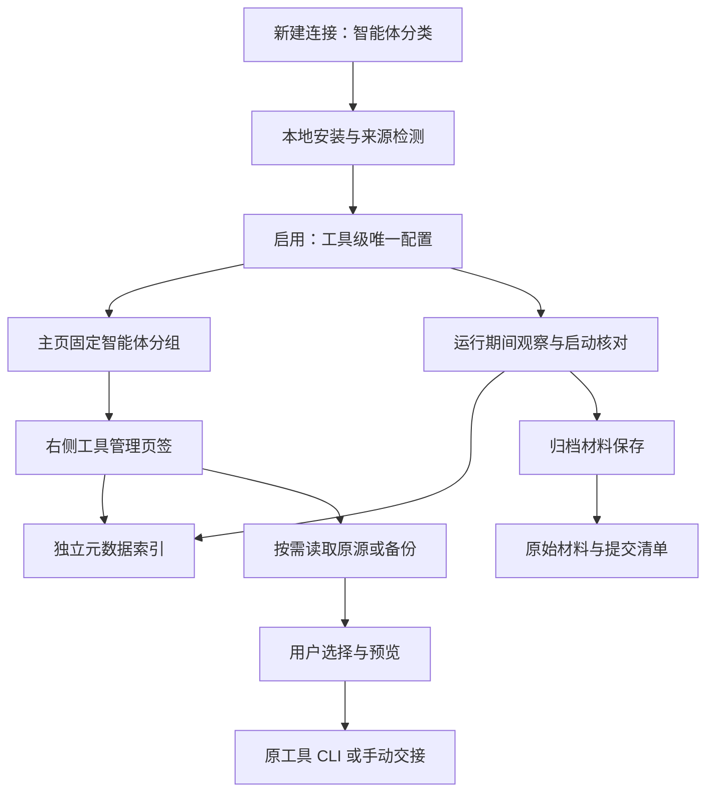

# GoNavi 智能体会话资产技术方案

- 版本：v0.2，2026-10-06，开发交接建议，尚未实现。
- 产品依据：[需求](requirements.md)、[交互设计](interaction-design.md)、[交接基线](README.md)。产品行为按基线执行，模块名、字段和方法为工程建议，可按现有架构调整。
- 证据分类：官方确认 / 本机观察 / 方案决策 / 开发前待验证；实验通过不等于产品通过。

## 1. 核心决策与分层

**方案决策**：共用“新建连接”的分类选择与主页左树；智能体的配置、索引、保全与交接使用独立领域模块。每种工具在当前 GoNavi 数据根下一个入口，可配置多个本地来源。首版仅 Codex；不增加新的代理执行引擎、模型聊天面板或凭据管理系统。



**仓库观察**：现有 ConnectionConfig 要求 host、port、user，SavedConnection 直接持有该配置；现有页签也假设 connectionId。新功能不能通过填写空数据库字段来接入。目录分类、页签按 ID 去重和树展示可以复用，但实体与动作必须增加显式类型。

建议最小接线：类型选择项带 `kind=database|agent`；工具选择分流到专门启用页；页签新增 `agent-assets` 类型与 `agentIntegrationId`，使用稳定页签 ID。数据库上下文解析、菜单及持久化清洗显式跳过智能体页签，不能让 SQL 操作获得虚构数据库连接。现有 connectionId 兼容处理须单独设计，避免全量重构 TabData。

## 2. 模块划分

以下是建议位置，不表示已经存在。

| 模块 | 责任 | 不承担的工作 |
| --- | --- | --- |
| `internal/sessionassets` | 配置、资产、保全调度、独立存储、依赖与删除 | 代理推理与模型执行 |
| `internal/sessionassets/adapters/codex` | 安装探测、元信息读取、历史格式识别、材料依赖解析 | 写原工具私有索引或伪造历史 |
| `internal/sessionassets/handoff` | 上下文计划、预览、目标配置与交接能力 | 默认更改全局 provider |
| `internal/app/methods_session_assets_*.go` | 参数校验、应用权限、本地服务调用及 QueryResult 整理 | JSONL 解析、复制事务、数据库 SQL |
| `frontend/src/components/agentConnections/` | 分类状态、检测和启用设置 | 数据库连接测试 |
| `frontend/src/components/sessionAssets/` | 会话列表、详情、材料与交接面板 | 直接读本机文件或管理认证 |
| `frontend/src/store/agentAssetsSlice.ts` | 小量视图状态、刷新和页签接线 | 保存聊天正文与大型备份 |

适配器按能力分开：DetectInstallation、DiscoverSources、ListMetadata、ReadHistory、ResolveCaptureMaterials；观察、原生继续与新建交接是独立可选能力。未实现能力返回具体原因，不要求每个工具实现同一套恢复接口。未知原始字段和不透明记录保留在材料中，公共读取模型只抽取可解释的部分。

Go 规约、上下文取消、领域错误、平台后缀、i18n 和文件体积限额遵循仓库要求；实际编码前读 GO_STYLE.md。

## 3. 检测、启用与状态

### 3.1 检测不是模型连接测试

依次检查明确指定位置、当前可解析命令、适配器已知安装位置、受支持的桌面/IDE 安装；不递归遍历整个用户目录，不运行来源不明的文件。版本查询有超时，返回路径及版本证据。仅目录残留不代表已安装。

检测数据位置只读取目录结构、格式版本和最小元数据；首次启用前不遍历正文。原工具已初始化、位置可读即可，不要求已有聊天。目录存在但权限受限或版本未知分别报告，支持手动定位后重新检测。

必须区分：采集可用、原始历史可读、CLI 可启动、原生继续可用、新建交接可用。只有 IDE 历史可读也可启用管理；认证、目标模型访问与 provider 连通性在用户实际交接时判断，不为检测发送 hello。

### 3.2 唯一性与生命周期

SQLite 对 `agent_kind` 设唯一约束；前端禁用重复按钮只是提示，后端幂等启用才是最终保证。多个 GoNavi 数据根或设备不共享这项唯一约束。来源使用规范化位置与可取得的文件系统身份去重；不能仅凭 thread ID 合并不同主机或冲突材料。

| 事件 | 服务行为 |
| --- | --- |
| 首次启用 | 校验检测结果尚有效，保存工具配置及来源，启动观察，异步建立索引与补保存现有归档 |
| 重复启用 | 返回已有配置与状态，不重复注册观察器或复制任务 |
| 关闭管理页签 | 只变更界面，不停止服务 |
| 禁用 | 停止接收新采集任务；正在提交的保存任务安全结束，长复制可取消并保留旧完整副本；取消未开始队列，重新启用时补核对 |
| 重新启用 | 检测后复用配置、资产与来源，核对仍存在的归档及完整候选 |
| 卸载/来源失效 | 标记可用性，不自动删除资产；已有备份仍能读取和导出 |
| 退出 GoNavi | 停止观察，结束或安全中断后台任务；不能宣称退出后继续保护 |

启用状态是用户设置，监听状态是运行事实；UI 分别表达。首版仅本地桌面启用，远程 Web/MCP 不默认获得任意文件读取和工具启动能力。共享数据根时每个材料库只能有一个保全写入者，通过平台文件锁保障；锁占用或观察启动失败可见，不显示“正在保护”。

## 4. 存储与资产身份

**仓库观察**：`internal/appdata` 已有可配置数据根，AI 配置及账本已有独立存储，go.mod 已依赖 modernc.org/sqlite。**方案决策**：默认完整材料库放在解析后的 GoNavi 数据根下 `session-assets/`，不复用内置 AI 账本或原工具数据库；自定义位置也存整个材料库（包括 catalog），不是仅将 raw 改到外部。数据根中只保留位置定位配置，不硬编码某台机器路径。启用后材料库位置只读，首版不实现迁移；全局数据根调整须识别外部定位，不能暗中丢弃或新建空材料库。

```text
session-assets/
  catalog.sqlite                 配置、来源、索引、任务、隐藏标记与复用关系
  assets/<asset-id>/current.json  latest 提交指针
  assets/<asset-id>/generations/<generation-id>/
    manifest.json                来源版本、范围、依赖、大小与哈希
    raw/                         原始记录及必要祖先固定前缀
    attachments/                 已保全的附件
  staging/                       未提交材料，完整候选可重启接续
  derived/                       可重建的本地可读材料缓存
  handoffs/                      用户主动生成的交接资料
```

首版优先材料集合自包含，跨资产物理去重留到后续；不为了省空间增加一套全局对象库。一个子资产内可去除重复依赖，固定祖先前缀在该子资产中独立保存，避免删除父资产破坏子资产。正常只有一份 latest，generation 仅用于更新提交和故障恢复，不构成多版本浏览库。

建议表：integrations、sources、assets、source_refs、capture_jobs、handoff_records、suppressed_sources；数据库存配置及元数据，不放大量会话正文或认证文件。工具 ID、来源 ID、资产 ID、原生 thread ID 分开；同一历史被 CLI 和 IDE 发现时建立来源引用，保留冲突证据，不自动覆盖。

current.json 与清单决定已提交材料事实，SQLite 的副本状态是可修复投影；两者不假装一个跨文件事务。启动时扫描提交清单修复副本索引。启用设置、删除隐藏标记等不可仅靠 raw 重建，必须纳入材料库整体备份。

用户如果备份 GoNavi，应覆盖整个目录；数据库在线备份需 SQLite 一致性方式，不能只复制正在写入的主文件而漏掉 WAL。原项目代码与工作目录另行保存。手动导出单个资产集合不等于迁移全部设置。

## 5. 观察策略与保全调度

**官方确认**：App Server 提供线程归档、取消归档等通知；归档有相应方法。通知不是原工具删除前的可靠全局拦截点。[官方 App Server](https://learn.chatgpt.com/docs/app-server)

**本机观察**：连接独立 App Server 的另一观察连接收到生命周期通知；现有桌面控制入口接入未成功。文件监听捕获人工桌面归档、取消归档和再次归档；停止监听期间仍存在的归档可在重启补保存。[实验报告（摘要）](evidence-summary.md)

**方案决策**：运行期间以实际来源目录变更观察为主，通知可用时作为补充。启用、启动、重新启用、重新检测、事件丢失或观察器重连时核对元数据和已有归档。事件合并只合并重复工作，不故意推迟首次归档复制。调度必须捕获“发现归档”的保存意图，不能因为短暂取消归档就覆盖尚未完成的保全工作。

首版不安装 hook。官方 SessionEnd 只覆盖部分结束场景，默认 1 秒、最多 3 秒，不能识别所有未打开聊天的删除；reason 也不能直接作为确定归档证据。[官方 Hooks](https://learn.chatgpt.com/docs/hooks) 将其加入首版会引入配置变更、信任、短时竞态和上下文输出约束，收益不足以替代观察。

不新增活跃正文周期备份，也不运行模型整理。若实际观察机制需要低频健康核对，只核对元数据/归档队列；频率是工程参数，不能偷换成定时保存活跃对话。活动元数据由原工具索引或按需最小解析读取，不对每次追加全量扫描大型 JSONL。

源删除与来源暂不可达分开判定；同一来源扫描完整成功后仍无记录可标为缺失，但目录移动、权限错误先标不可用。仅“缺失”不自动删除副本，也不宣称已获得用户的永久删除意图。读取与复用不必等待此结论，可明确从旧副本读取。

### 5.1 保存事务

1. 记录来源版本、归档事件及 capture intent；持久化任务后尽快打开可读源。
2. 流式复制原始记录及可识别必要依赖到同一材料文件系统的 staging，不做语义摘要；大型文件不整份进内存。
3. 祖先历史按分叉边界保存固定前缀，附件列明内嵌、外部可用、缺失和仅引用；不把整个项目目录作为附件递归复制。
4. 复制时计算哈希，校验大小/格式与源变化，写完整清单并同步文件。必要依赖缺失时标为部分候选，不能替换现有完整 latest。
5. 同资产串行、每个启用代次有取消令牌；提交校验预期旧版本与源事件顺序，旧任务不能覆盖较新结果或复活已删除资产。
6. 完整候选就绪后原子替换 current 指针，再修复 SQLite 状态，最后回收旧 generation；提交前失败保留旧 latest。
7. 无完整 latest 时允许展示独立保存的部分材料及缺失说明；它不宣称“完整备份成功”。后续补齐成功再替换。

跨平台 replace 与目录同步需平台实现及故障测试；本机实验只验证了局部提交原型，未证明断电、Windows、网络盘和多写入者安全。首版材料库使用本地文件系统，网络盘与同步盘不保证同等原子性。不能承诺 1–3 秒必定完成任意大小的历史集合。

禁用/退出时不先删除候选。启动核对不完整写入、完整未提交、已提交未清理三种阶段；不以数据库一条 success 字段判断材料有效。副本最新版本的完整性、可读范围和目标可用性分别表达。

## 6. 读取、删除和依赖

原源仍可访问时按需读取，备份作为独立选择；源不可达时可读 latest，明确覆盖时间。活跃会话没有副本是正常状态。JSONL 使用流式/分页读取，可读消息与工具调用结果关联；压缩密文原样保留，不猜测或伪造其含义。

用户在 GoNavi 删除资产时：先持久化该来源身份的抑制标记和删除任务，禁止新保存提交；解除本资产材料与派生材料引用，再清理文件，最后记录结果。文件删除失败说明待清理，不显示完全擦除成功。下一轮发现同一源不能自动重新纳入；未来显式“重新纳入”才能解除抑制，不能仅通过禁用再启用绕过。

子资产材料自包含时，父资产删除不会伤及它；若将来做共享去重，必须以当前已提交清单的引用关系回收，不能只凭父子标题。子资产里必要的父历史仍属于子资产保留范围，删除确认必须说明。没有回收站，不承诺 GoNavi 永久删除后可恢复。

## 7. Provider、认证与原工具交接

**方案决策**：provider 不改变资产可见性。历史配置、当前观测配置、本次目标配置分开。原生继续默认同 provider，跨 provider 默认新建；不修改 raw、消息 ID、原工具索引或全局 config.toml。

官方 CLI 支持本次运行配置覆盖；当前 profile 语法存在版本差异，启动器必须按安装版本协商，不能直接使用旧配置预设。[官方配置](https://learn.chatgpt.com/docs/config-file/config-advanced)

CC Switch 可作为已有配置的可选来源，首版不依赖它。当前配置、用户明确指定的配置与历史配置都有来源标签；旧 DeepSeek 预设不能覆盖用户当前华龙 GPT 配置。认证由原工具或既有 secretstore 安全引用按需取得，不复制 auth.json、CC Switch 全库、密钥或完整进程环境到材料库，不输出秘密到日志/参数预览。

交接计划包含：材料版本与范围、可读文本/附件、目标工具和入口、provider、工作目录、当前请求和缺失说明。用户预览后才对外发送，后台采集从不生成此类模型请求。旧历史是引用资料，不升级为新环境指令或授权；当前项目的指令仍由原工具加载。

首版输出两条能力：同 provider 原生继续；携带历史创建新会话。优先使用受支持 CLI/协议接口，由官方界面承担后续对话、审批和执行。**不把“GoNavi 能调用 turn/start”当成必须在 GoNavi 内建立运行窗口的理由。**

创建 ID、发送资料、打开原工具可交互入口是三个独立结果。实现前要验证如何把新上下文交给已安装 CLI 并让用户继续在原工具操作，凭据与正文不能随意拼入进程参数。官方协议支持不等于存在已验证的桌面/IDE窗口交接。无法完整交接时首版提供材料导出/复制及经过核验的操作说明，按钮明确“准备材料”，不声称已创建会话。

App Server 可用于用户主动要求的受支持操作，但不能以 resume 全部历史作为索引方式。官方文档提供 read/list 等能力，某些分页为实验能力，实际版本不支持时按需读取材料降级。[官方 App Server](https://learn.chatgpt.com/docs/app-server)

自动索引以只读来源读取为主。官方 thread/list 默认可扫描并修复元数据，不能直接当作无写入观察；使用协议读取时必须核对版本、选项与实际副作用。原工具 SQLite 以只读方式读取并兼顾 WAL，一次短事务取得一致的元信息；无法安全识别时降级为最小文件元信息，不运行修复或改造 schema。

## 8. 首版能力矩阵与验收

| 能力 | 当前证据 | 实现约束 |
| --- | --- | --- |
| macOS Codex 原始记录、归档与备份利用 | 本机受控实验通过 | 产品尚未实现，按版本建适配测试 |
| CLI 同 provider 续聊 / 可读历史新建 | 本机受控实验通过 | 不保证所有历史格式和服务端兼容 |
| PyCharm 内置 Codex 退出重开续聊 | 本机与用户配合通过 | 不能推定任意 IDE、任意版本 |
| 桌面外部全局通知、真实 provider 切换 | 未完成 / 已移出本轮验证 | 文件观察为主，不承诺恢复桌面窗口 |
| IDEA、Windows/Linux、其他智能体 | 未实际验证 | 声明适配目标，不显示为支持通过 |
| 云端/远程持续采集、跨设备同步 | 首版不支持 | 不把本地来源识别误称云同步 |

主要开发验收：工具唯一启用与来源去重；缺安装/无权限/IDE-only 检测；禁用保留资产与页签独立；归档/取消归档/重归档；事件丢失与重启补核对；连续归档删除尽力保全；五类提交故障；旧任务与重归档/删除并发；多级 fork 固定前缀；附件/长历史/不透明压缩；GoNavi 删除后不重新出现；provider 隔离与秘密不落盘；交接创建证据和失败降级；本地跨平台原子替换与锁。

测试使用虚构夹具和可丢弃的隔离会话，不依赖生产密钥。最小路径先走通：分类启用 → 左树 → 元数据列表 → 归档副本 → 原删除后读取/导出；再接原生继续与自动新建。

需要单独确认的范围扩大只有：常驻服务、主动备份活跃全文、云/远程采集、新凭据管理或在 GoNavi 内运行代理。普通模块、字段与页面拆分由设计/工程按本稿继续细化。

## 9. 本轮交付与待办

已完成入口、生命周期、模块、存储、保全事务与交接边界设计；没有验证产品代码或修改真实会话。接入预览只使用虚构数据。

开发前仍需：选择并验证跨平台目录观察实现；核对原工具版本与检测路径；确定原始元信息只读读取策略；验证终端/官方入口的最终交接；明确平台原子替换与锁测试。材料库迁移暂不实现。前述实验只作为可行性证据，不得直接复制为生产实现；先读 [证据摘要](evidence-summary.md)，本机研究目录不可得不影响使用虚构夹具推进开发。
