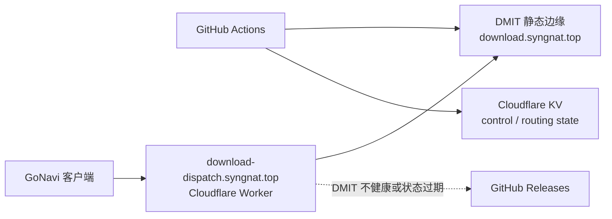

# GoNavi 下载调度与 DMIT 单边缘运维

## 生产拓扑



- `download-dispatch.syngnat.top` 是 Cloudflare Worker Custom Domain，只返回 JSON 或 `302`，绝不代理大文件内容。
- `download.syngnat.top` 是 DNS-only 的 DMIT 静态站点，根目录为 `/srv/gonavi-downloads`；由本地 Caddy 直接提供文件。
- GitHub Releases 是唯一灾备源。腾讯节点、GatewaySentry 和 Cloudflare R2 不参与客户端下载、Worker 路由或发布控制。

## 发布流程

1. `tools/prepare-vps-release-payload.py` 从已校验的 release 产物生成 payload、`deployment.json` 和 `SHA256SUMS`。
2. `tools/publish-edge-release.sh` 仅通过受限 `gonavi-cdn` 用户上传 DMIT 的 `.incoming/<generation>`。
3. DMIT 上的 root-owned transaction 依次执行 `verify`、`promote-immutable`、`promote-mutable` 和 `finalize`。
4. CI 通过公网 HTTPS 校验真实 Range、generation、`healthz`，并记录八路吞吐观测。
5. CI 在公网 Range 和 `/healthz` 校验后，以短期 `verifiedAt` 证明先写 `control:history:<channel>:<generation>`，再原子写入 `control:<channel>` 到 Worker KV。

`control:<channel>` 只记录 DMIT，并记录本次 app 和 driver 的实际发布 tag。Worker 仅为 tag 与当前 control 一致的 immutable 文件下发 DMIT，避免 GitHub 新版本先公开时被误导向旧 DMIT 目录；latest manifest 和 driver index 仍可走当前健康 DMIT。

## 超时与失败行为

发布脚本必须有限等待：

- SSH 连接超时 15 秒，保活间隔 15 秒，连续 4 次未响应断开；marker、空间检查和建目录最多 60 秒，事务命令最多 300 秒，retention 最多 120 秒。
- payload 准备最多 600 秒；`rsync` 空闲 I/O 最多 120 秒，整个传输最多 900 秒。
- Range、health HTTP 请求最多 60 秒，8 路吞吐观测每路最多 120 秒，KV 写入连接最多 10 秒、单次最多 30 秒。
- 所有受控命令超时后先发 `TERM`，15 秒后强杀；吞吐观测失败仅写入 `limited` 告警，不阻断已经通过 Range 与 health 的发布。
- 发布脚本最坏约 62 分钟；dev 与 stable 发布 job 的总上限是 120 分钟，避免在 mutable 已切换、KV 尚未写入时被 workflow 强杀。

DMIT 任一必要阶段失败时，发布失败且不写新的 KV control；不会无限等待，也不会尝试腾讯。运行中的日志直接输出 `[dmit]` 阶段信息，便于定位 SSH、传输、校验或激活失败。

## Worker 和客户端行为

Worker 每 5 分钟检查 DMIT 的：

- 受系统信任的 HTTPS；
- `/healthz` 中的 `ready=true` 和目标 generation；
- control 指定 immutable 文件的真实 `206`、`Content-Range`、`Content-Length` 和总大小。

新 control 携带 CI 刚完成的 `verifiedAt` 时，Worker 只会在 15 分钟内为同一 app/driver tag 立即选择 DMIT；旧 routing state 不会复用于新 generation。首轮 cron 会把这次验证固化为健康状态，之后仍遵循连续 2 次成功和连续 3 次失败、或健康状态超过 12 分钟未刷新后摘除的规则。KV 跨 PoP 尚未传播时安全回退 GitHub。JSON 和旧客户端 `302` 的顺序均为：健康 DMIT，随后 GitHub Releases。客户端按候选顺序执行严格 Range 校验并立即开始下载，DMIT 失败才探测 GitHub；不再有区域偏置或腾讯节点选择。

单边缘的边界是明确的：DMIT 故障时下载会回退到 GitHub，而没有第二个自建边缘。

## DMIT 安装契约

仓库只维护 DMIT 安装路径：

```bash
sudo deploy/download-mirror/install-edge.sh \
  dmit /srv/gonavi-downloads caddy \
  deploy/download-mirror/dmit-caddy-site.caddy caddy
```

DMIT 现有 Caddy 监听器同时承载其他站点。安装器只暂存 `download.syngnat.top` 片段，要求在现有 Caddyfile 中导入 `/etc/caddy/conf.d/*.caddy`，并在 reload 前执行 `caddy validate`；不得安装 Nginx 抢占 80/443，也不得替换完整 Caddyfile。

immutable 文件必须支持 HEAD、Range/206、稳定 ETag，并返回 `Cache-Control: public,max-age=31536000,immutable`。latest、latest-dev、driver index 和 healthz 使用 `no-cache` 或 `no-store`。

## 权限与凭据

发布只需要：

- `CDN_DMIT_SSH_HOST`
- `CDN_DMIT_SSH_PORT`
- `CDN_DMIT_SSH_USER`
- `CDN_DMIT_SSH_PRIVATE_KEY`
- `CDN_DMIT_SSH_KNOWN_HOSTS`
- `CLOUDFLARE_ACCOUNT_ID`
- `CLOUDFLARE_KV_API_TOKEN`
- `CLOUDFLARE_WORKERS_API_TOKEN`
- repository variable `ROUTING_STATE_KV_ID`

DMIT 的 SSH 用户只能写 `.incoming`。正式文件、状态、事务、`healthz` 和 marker 均由 root 管理；CI 只能通过 `/usr/local/libexec/gonavi-edge-transaction` 和 `gonavi-edge-retention` 进行受控提升与清理。

## 上线与验收

先部署 DMIT-only Worker，再运行新的 dev 或 stable 发布：

1. 手动触发 `Deploy Download Dispatcher`，通过 `npm run check` 后部署 Worker。
2. 运行 dev build 或 stable publish，使 KV control 更新为 DMIT-only。
3. 请求 `https://download-dispatch.syngnat.top/v1/resolve?format=json&path=<合法产物路径>`，确认 candidates 仅为 `dmit`、`github`。
4. 验证旧式 `302` 的 `X-GoNavi-Download-Source` 为 `dmit`；DMIT 不健康时应为 `github`。

腾讯 GitHub secrets 和腾讯服务器文件不由本仓库改动自动删除。DMIT 发布和 Worker 验收稳定后，再由运维人员单独删除不再使用的 `CDN_TENCENT_*` secrets，并按独立变更窗口处理腾讯服务器下线。
