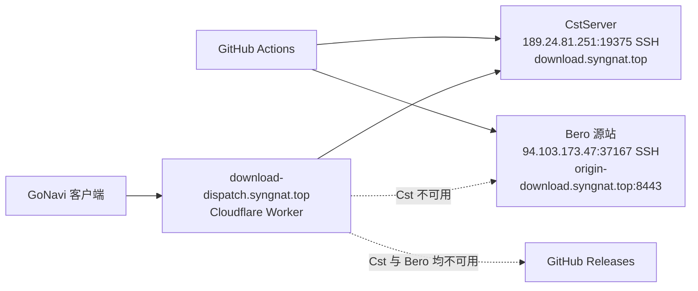

# GoNavi 下载源运维

## 生产拓扑



- `download-dispatch.syngnat.top` 是 Cloudflare Worker Custom Domain，只返回候选 JSON 或 `302`，不代理大文件。
- `download.syngnat.top` 是保留给旧客户端和已发布 manifest 的公开下载域名，DNS 应指向 CstServer；Cloudflare 代理回源到 Cst 的 `8443`。
- Bero 是第二候选，公网地址固定为 `https://origin-download.syngnat.top:8443`，经 Cloudflare 代理回源到 `94.103.173.47:8443`。
- GitHub Releases 是最后灾备源。

所有 channel、应用资产、驱动资产和 manifest 的候选顺序都固定为：**Cst -> Bero -> GitHub**。Worker 没有区域偏置，也不依赖远程发布状态。

## Cloudflare DNS/TLS 契约

在 Cloudflare 控制台完成以下设置：

1. `download.syngnat.top` 的 A 记录指向 `189.24.81.251`，开启 Proxied/橙云；为该 hostname 建立 Origin Rule，将回源端口设为 `8443`。
2. `origin-download.syngnat.top` 的 A 记录指向 `94.103.173.47`，开启 Proxied/橙云；该 hostname 也回源到 `8443`。
3. 为两个 hostname 生成覆盖对应名称的 Origin CA 证书，分别上传到：
   - Cst：`/etc/ssl/cloudflare/download.syngnat.top.pem` 和 `.key`；
   - Bero：`/etc/ssl/cloudflare/origin-download.syngnat.top.pem` 和 `.key`。
4. SSL/TLS 使用 `Full (strict)`。不要为下载 hostname 配置 Access、浏览器挑战、验证码或会改写响应的规则。
5. 源站防火墙只需允许 Cloudflare 回源网段访问 `8443`；SSH 使用 Cst 的 `19375` 和 Bero 的 `37167`，并固定 host key。

Cloudflare 的域名、Origin Rule 和证书必须在控制台完成；代码和 CI 不会修改这些设置。

## 发布流程

1. `tools/prepare-vps-release-payload.py` 从已校验的 release 产物生成 payload、`deployment.json` 和 `SHA256SUMS`。
2. `tools/publish-edge-release.sh` 使用两套独立 SSH 凭据，将同一 generation 上传到 Cst 和 Bero 的 `/srv/gonavi-downloads/.incoming/`。
3. 两个节点上的 root-owned transaction 依次执行 `verify`、`promote-immutable`、`promote-mutable` 和 `finalize`。CI 不上传可执行发布逻辑，也不直接写正式目录。
4. CI 分别从公网验证两个 hostname 的 `/healthz`、HEAD 和 Range；immutable 产物必须返回真实 `206`、正确 `Content-Range`、`Content-Length` 和 SHA-256。
5. 两个节点都通过验证后，发布脚本才成功退出。Worker 始终返回静态三源链，不需要额外发布步骤。

任一节点上传、校验、公开 Range 或 health 验证失败，本次发布失败，避免两个源的 generation 分裂。旧 generation 文件由节点上的 retention helper 按磁盘预算清理。

## Worker 和客户端行为

Worker 对合法资产路径返回：

1. `cst`：`https://download.syngnat.top/...`；
2. `bero`：`https://origin-download.syngnat.top:8443/...`；
3. `github`：对应 GitHub Releases URL。

`require-current=1` 是旧客户端留下的兼容参数。对 dev immutable 应用资产，Worker 会用两端 `/healthz` 的同一 `appTag` 和 `generation` 做当前资产校验；任一节点不可用时仍可由另一节点证明当前资产，两个健康节点的 generation 不一致则 fail-closed 返回 `503`。资产不匹配仍返回 `409`，路径仍经过严格 allowlist 校验，非法路径返回 `400`。

客户端对每个候选执行状态码、Range、大小和校验检查；网络、DNS、TLS、超时或 5xx 失败会继续下一个候选。资产过期时客户端仍保留既有的 manifest 刷新语义，刷新后只重试一次。

## 节点安装

CstServer 和 Bero 都使用 Nginx `8443` 静态站点。安装前先把对应 Origin CA 私钥放到 root-only 目录，然后执行：

```bash
sudo deploy/download-mirror/install-edge.sh \
  cst /srv/gonavi-downloads nginx \
  deploy/download-mirror/cst-download.conf www-data

sudo deploy/download-mirror/install-edge.sh \
  bero /srv/gonavi-downloads nginx \
  deploy/download-mirror/bero-origin-download.conf www-data
```

安装器只写入 `/etc/nginx/conf.d/gonavi-download.conf`，先执行 `nginx -t`，运行中的服务 reload，未启动的服务才 enable 并启动；不会替换完整 Nginx 配置。两个片段都禁止占用 `80`、`443` 和 `2053`。

静态服务器要求：

- `/healthz` 返回 JSON、`Cache-Control: no-store`；
- `latest`、`latest-dev` 和 driver index 使用 no-cache/no-store；
- immutable 路径支持 HEAD、Range/206、稳定 ETag 和 `Cache-Control: public, max-age=31536000, immutable`；
- 不做 gzip/brotli 转码、HTML fallback、URL 重写或认证跳转。

## GitHub Actions 凭据

发布 action 使用以下 secrets：

- Cst：`CDN_CST_SSH_HOST`（`189.24.81.251`）、`CDN_CST_SSH_PORT`（`19375`）、`CDN_CST_SSH_USER`、`CDN_CST_SSH_PRIVATE_KEY`、`CDN_CST_SSH_KNOWN_HOSTS`；
- Bero：`CDN_BERO_SSH_HOST`（`94.103.173.47`）、`CDN_BERO_SSH_PORT`（`37167`）、`CDN_BERO_SSH_USER`、`CDN_BERO_SSH_PRIVATE_KEY`、`CDN_BERO_SSH_KNOWN_HOSTS`。

repository variable `CDN_BERO_BASE_URL` 必须固定为 `https://origin-download.syngnat.top:8443`。Worker 部署只需要 `CLOUDFLARE_WORKERS_API_TOKEN` 和 `CLOUDFLARE_ACCOUNT_ID`，发布 action 不需要 Cloudflare API 凭据。

## 上线验收

1. 在 CstServer 上安装证书、Nginx 配置和受限 `gonavi-cdn` 用户；用 `ssh -G CstServer-DE-2H2` 核对实际 host、port 和 key。
2. 在 Cloudflare 控制台完成两个 DNS 记录、Origin Rule 和 `Full (strict)`，再从公网请求两个 `/healthz`。
3. 用 HEAD 和 `Range: bytes=0-1023` 验证两个公网 endpoint 的真实 `206`，确认没有挑战页或错误缓存。
4. 手动运行 `Deploy Download Dispatcher`，确认 `npm run check` 通过。
5. 运行一次 dev build 或 stable publish，确认 Cst、Bero 得到同一 generation，随后请求 Worker 的 `format=json`，候选必须为 `cst`、`bero`、`github`。
6. 暂时阻断 Cst，确认客户端继续 Bero；再阻断 Bero，确认最终继续 GitHub。

旧状态存储已从 Worker、发布脚本和 action 中移除。确认新 Worker 和三源公网下载连续稳定后，再在 Cloudflare 控制台删除对应旧 namespace；删除前保留一次导出或截图作为审计记录。用量告警应在 Cloudflare Notifications 中单独配置，不由下载 Worker 发送邮件。
