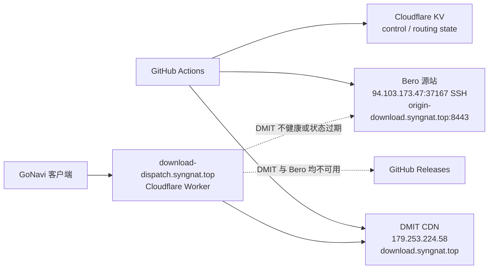

# GoNavi 下载调度与双节点运维

## 生产拓扑



- `download-dispatch.syngnat.top` 是 Cloudflare Worker Custom Domain，只返回 JSON 或 `302`，绝不代理大文件内容。
- `download.syngnat.top` 是 DMIT 的静态下载域名，解析到 DMIT（`179.253.224.58`）。DMIT 是默认下载节点，也是 CI 的第一个上传目标。
- Bero 是唯一的回退源站，地址为 `94.103.173.47`，SSH 端口为 `37167`。CI 与 Worker 的节点 ID 都是 `bero`。
- `CDN_BERO_BASE_URL` 固定为 `https://origin-download.syngnat.top:8443`。它必须是单独的 Cloudflare 橙云代理 URL，不能填写 Bero IP、DMIT 域名或旧 GatewaySentry 地址。
- GitHub Releases 是最后灾备源。GatewaySentry（旧地址 `157.254.234.28`）、腾讯节点和 Cloudflare R2 不参与上传、下载调度或 KV control。

下载候选顺序必须始终是：**DMIT -> Bero（Cloudflare 代理 HTTPS） -> GitHub**。DMIT 仍是默认源；Bero 不应通过源站 IP 直接暴露给 Worker 或客户端。

## Cloudflare 与 Bero DNS/TLS 契约

Cloudflare 为 `origin-download.syngnat.top` 保留单独的 DNS 记录：

1. `A` 记录指向 `94.103.173.47`；只有 Bero 已配置并验证 IPv6 时才增加 `AAAA` 记录。
2. 代理状态必须是 **Proxied/橙云**。Cloudflare 支持代理 HTTPS `8443`，因此客户端和 Worker 都使用 `https://origin-download.syngnat.top:8443`，不是裸 IP 或省略端口的 `443` URL。
3. Bero 的 `443` 已由 sing-box 占用。Nginx 只监听公开 TLS `8443`，不得抢占 `80`、`443` 或 `2053`。使用覆盖 `origin-download.syngnat.top` 的 Cloudflare Origin CA 证书；证书和私钥分别放在 `/etc/ssl/cloudflare/origin-download.syngnat.top.pem` 与 `/etc/ssl/cloudflare/origin-download.syngnat.top.key`，私钥必须仅 root 可读。
4. Cloudflare SSL/TLS 应使用 `Full (strict)`。在无法立刻切换整个 zone 时，Bero 的 Origin CA 证书仍应先安装好，待同区其他旧服务完成证书迁移后再切换。
5. 不要为该主机启用 Access 登录、浏览器挑战、强制验证码或改写下载响应的规则。否则健康检查和 Range 下载会被误判为源站故障。
6. 源站防火墙可只允许 Cloudflare 的 HTTPS 回源网段访问 `8443`；SSH 仅开放 `37167`，并使用受限 `gonavi-cdn` 用户和固定 host key。

`CDN_BERO_BASE_URL` 只表示公网 HTTPS 基础 URL，必须恰好为 `https://origin-download.syngnat.top:8443`。不要增加尾部 `/`、`/gonavi`、`/drivers` 或任何具体产物路径。

## 发布流程

1. `tools/prepare-vps-release-payload.py` 从已校验的 release 产物生成 payload、`deployment.json` 和 `SHA256SUMS`。
2. `tools/publish-edge-release.sh` 使用两套独立 SSH 凭据，将同一 generation 上传到：
   - DMIT：`CDN_DMIT_SSH_HOST` 必须为 `179.253.224.58`；
   - Bero：`CDN_BERO_SSH_HOST=94.103.173.47`、`CDN_BERO_SSH_PORT=37167`。
3. 两个节点都先写入各自的 `.incoming/<generation>`，再由节点上的 root-owned transaction 依次执行 `verify`、`promote-immutable`、`promote-mutable` 和 `finalize`。CI 不上传可执行发布逻辑，也不直接写正式目录。
4. CI 分别从公网验证 DMIT 域名和 `CDN_BERO_BASE_URL`：`/healthz` 必须返回 `ready=true` 和目标 generation；immutable 产物必须返回真实 `206`、正确 `Content-Range`、`Content-Length`、总大小和 SHA-256。
5. 只有 DMIT 与 Bero 均完成验证后，才写入 `control:history:<channel>:<generation>`，再原子更新 Worker KV 的 `control:<channel>`。control 同时记录 `dmit` 和 `bero` 的 base URL、enabled 状态及本次 app/driver tag。
6. 如果任一节点上传、校验、公开 Range 或 health 验证失败，发布失败且不写新的 KV control；不能只发布 DMIT 后把 Bero 留在旧 generation，也不能回退到 GatewaySentry。

两台服务器必须保留相同的目录、文件内容和 generation。Bero 是源站而不是默认 CDN：它必须保留当前已验证版本，供 DMIT 故障时立即回退。

## 超时与失败行为

发布脚本必须对两个节点分别有限等待：

- SSH 连接超时 15 秒，保活间隔 15 秒，连续 4 次未响应断开；marker、空间检查和建目录最多 60 秒，事务命令最多 300 秒，retention 最多 120 秒。
- payload 准备最多 600 秒；每个节点的 `rsync` 空闲 I/O 最多 120 秒，单节点整个传输最多 900 秒。
- DMIT 域名和 Bero Cloudflare 域名的 Range、health HTTP 请求最多 60 秒，8 路吞吐观测每个节点每路最多 120 秒；KV 写入连接最多 10 秒、单次最多 30 秒。
- 所有受控命令超时后先发 `TERM`，15 秒后强杀。吞吐观测失败仅记录 `limited` 告警，但 Range 与 health 未通过时不得写 KV control。
- 任一节点失败都应使本次发布失败，防止两个源的 generation 分裂。客户端运行时仍按 DMIT、Bero、GitHub 的顺序回退。

## Worker 和客户端行为

Worker 维护两个 canonical 节点，固定顺序为 `dmit`、`bero`。每 5 分钟检查每个启用节点的：

- 受系统信任的 HTTPS；
- `/healthz` 中的 `ready=true` 和目标 generation；
- control 指定 immutable 文件的真实 `206`、`Content-Range`、`Content-Length` 和总大小。

新 control 携带 CI 刚完成的 `verifiedAt` 时，Worker 只会在 15 分钟内为同一 app/driver tag 立即选择 DMIT；若 DMIT 失败、状态过期或跨 PoP 的健康状态不可用，则按同一 generation 选择 Bero。Bero URL 来自 control 中的 `CDN_BERO_BASE_URL`，请求路径与 DMIT 完全相同，流量经 Cloudflare 代理到 `94.103.173.47:8443`。

旧 KV 的 `nodes.netcup` 不会映射为 Bero：旧 generation 尚未在 Bero 验证，迁移窗口内它会被视为禁用，DMIT 不可用时直接回退 GitHub。下一次成功双节点发布会写入只含 `dmit`、`bero` 的新 control；旧 `CDN_NETCUP_*` secrets/variable 可暂时保留作人工回滚，但 workflow、action 与发布脚本不得引用它们。

JSON 响应和旧客户端 `302` 的候选顺序都必须是：

1. `dmit`：`https://download.syngnat.top/...`；
2. `bero`：`https://origin-download.syngnat.top:8443/...`；
3. `github`：对应 GitHub Releases URL。

Worker 只返回候选，不跟随或代理文件；客户端按顺序执行严格的 Range、状态码、`Content-Range`、大小和校验校验，当前候选失败立即尝试下一个。没有区域偏置，也没有腾讯/GatewaySentry 分支。

## 节点安装契约

DMIT 的现有安装路径保持不变：

```bash
sudo deploy/download-mirror/install-edge.sh \
  dmit /srv/gonavi-downloads caddy \
  deploy/download-mirror/dmit-caddy-site.caddy caddy
```

DMIT 现有 Caddy 监听器同时承载其他站点。安装器只暂存 `download.syngnat.top` 片段，要求在现有 Caddyfile 中导入 `/etc/caddy/conf.d/*.caddy`，并在 reload 前执行 `caddy validate`；不得安装 Nginx 抢占其 80/443，也不得替换完整 Caddyfile。

Bero 必须按相同目录和权限契约部署 `/srv/gonavi-downloads`、root-owned transaction/retention helper、`healthz` 和静态站点。先把 Cloudflare Origin CA 证书放到上文规定路径，随后运行：

```bash
sudo deploy/download-mirror/install-edge.sh \
  bero /srv/gonavi-downloads nginx \
  deploy/download-mirror/bero-origin-download.conf www-data
```

安装器只写入 `/etc/nginx/conf.d/gonavi-download.conf`，先执行 `nginx -t`，运行中的服务 reload，未启动的服务才 enable 并启动；它不会替换完整 Nginx 配置。Bero 片段必须声明 `server_name origin-download.syngnat.top`、`root /srv/gonavi-downloads` 和 TLS `listen 8443`，并拒绝占用 `80`、`443` 或 `2053`。DMIT 继续使用上面的 Caddy 命令，不能用 Bero 参数重装。

immutable 文件必须支持 HEAD、Range/206、稳定 ETag，并返回 `Cache-Control: public,max-age=31536000,immutable`。latest、latest-dev、driver index 和 healthz 使用 `no-cache` 或 `no-store`。Cloudflare 代理侧必须保留真实 `206`、`Content-Range`、`Content-Length`、ETag 和 `Accept-Ranges`，不能把挑战页、错误页或压缩转换后的响应缓存成资产。

两个节点必须由各自的静态服务器（DMIT 使用 Caddy，Bero 使用 Nginx）提供同一根目录 `/srv/gonavi-downloads`，并同时满足：

- `/healthz` 返回 `Content-Type: application/json`、`Cache-Control: no-store`，内容至少包含 `schemaVersion`、`status`、`ready`、`nodeId` 和两个 channel 的 generation；
- `latest`、`latest-dev`、driver index 等 mutable 路径使用 `no-store` 或 `no-cache, must-revalidate`，避免 Cloudflare 或浏览器继续使用旧指针；
- immutable 路径不做 gzip/brotli 转码、HTML fallback、URL 重写或认证跳转。`Content-Length` 与 `Content-Range` 必须对应原始字节，`Range: bytes=0-1023` 应从两个公网 endpoint 得到 `206`；
- 缓存规则可以缓存 immutable 文件，但发布验收必须经过 Cloudflare 代理实际验证 Range。不要缓存 4xx/5xx、挑战页或错误的 `206`；新 generation 通过新目录和 mutable 指针切换，不原地覆盖 immutable 文件。

## 权限与凭据

发布需要以下 GitHub Actions secrets：

- DMIT（保持现状，不修改目标）：`CDN_DMIT_SSH_HOST`、`CDN_DMIT_SSH_PORT`、`CDN_DMIT_SSH_USER`、`CDN_DMIT_SSH_PRIVATE_KEY`、`CDN_DMIT_SSH_KNOWN_HOSTS`。其中 host 应解析/固定到 `179.253.224.58`。
- Bero：`CDN_BERO_SSH_HOST`、`CDN_BERO_SSH_PORT`、`CDN_BERO_SSH_USER`、`CDN_BERO_SSH_PRIVATE_KEY`、`CDN_BERO_SSH_KNOWN_HOSTS`。必须分别为 `94.103.173.47`、`37167`、`gonavi-cdn`、部署私钥和 Bero 的固定 host key；不要填 `157.254.234.28`，也不要复用旧 `MIRROR_SSH_*`。
- Cloudflare KV：`CLOUDFLARE_ACCOUNT_ID`、`CLOUDFLARE_KV_API_TOKEN`；部署 Worker 另需 `CLOUDFLARE_WORKERS_API_TOKEN`。

还需要以下 repository variable：

- `CDN_BERO_BASE_URL`：固定为 `https://origin-download.syngnat.top:8443`，必须与 DNS、Origin CA 证书和 Worker control 中的 Bero 节点一致；不能是 IP、DNS-only 主机、DMIT 域名或 GatewaySentry 域名。
- `ROUTING_STATE_KV_ID`：Worker routing state KV namespace ID。

Bero 和 DMIT 的 SSH 用户只能写 `.incoming`。正式文件、状态、事务、`healthz` 和 marker 均由 root 管理；CI 只能通过节点上已安装的 transaction/retention helper 进行受控提升与清理。DMIT 的现有配置和文件不因 Bero 迁移而重装或改名。

## 上线与验收

先完成 Bero 主机、Nginx、Origin CA 证书和 Cloudflare DNS/TLS 配置，再部署 Worker：

1. 确认 `CDN_BERO_SSH_HOST=94.103.173.47`、`CDN_BERO_SSH_PORT=37167`、host key 与受限用户；确认 `CDN_DMIT_SSH_HOST` 仍为 `179.253.224.58`。旧 `CDN_NETCUP_*`/`MIRROR_SSH_*` 即使暂时仍存在于 GitHub secret store，也不得被 workflow、action 或脚本引用；`157.254.234.28` 同样不得进入新链路。
2. 在 Cloudflare DNS 中确认 `origin-download.syngnat.top` 为橙云、A 记录指向 `94.103.173.47`，并从公网请求 `https://origin-download.syngnat.top:8443/healthz`。不要把公网回退 URL 改成源站 IP 或 `443`。
3. 从公网验证两个 endpoint 的 `/healthz`、HEAD 和一个小 Range；对 Bero 必须验证经过 Cloudflare 的 `:8443` 响应，而不是直接请求 `94.103.173.47`。
4. 手动部署 `Deploy Download Dispatcher`，确认 `npm run check` 通过后再部署 Worker。该版本必须忽略旧 KV 的 `netcup` URL，直至首次 Bero 双节点发布完成，避免把旧 generation 错误路由到新源站。
5. 运行一次 dev build 或 stable publish，确认两个节点都得到同一 generation，KV control 同时包含 `dmit`、`bero`，且 `candidates` 顺序为 `dmit`、`bero`、`github`。
6. 模拟 DMIT 不健康：JSON 和旧式 `302` 的第一个候选应为 Bero；恢复 DMIT 后默认源应回到 DMIT。再模拟 Bero/Cloudflare 不健康，确认最终回退 GitHub。
7. 验证客户端对三个候选都执行 Range/校验失败回退；确认 Worker 从不代理大文件，Bero fallback 的实际 TCP/HTTPS 入口是 Cloudflare `:8443` 而不是源站 IP。

不要在本次变更中删除 DMIT、修改 DMIT 的 Caddy 监听器或删除旧 GatewaySentry 服务器；这些是独立的运维变更。DNS、secrets、KV 和客户端缓存中若还存有旧地址，应在 Bero 发布和公网验收稳定后单独下线，不能让新 CI 误上传过去。
